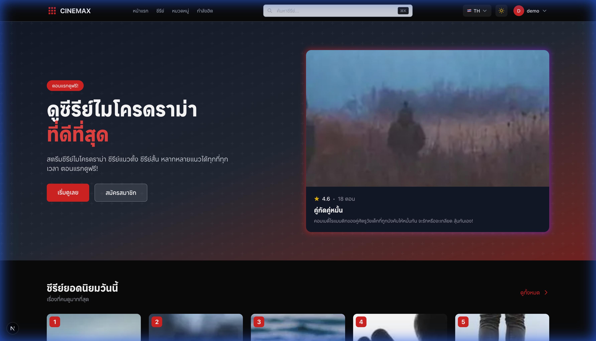
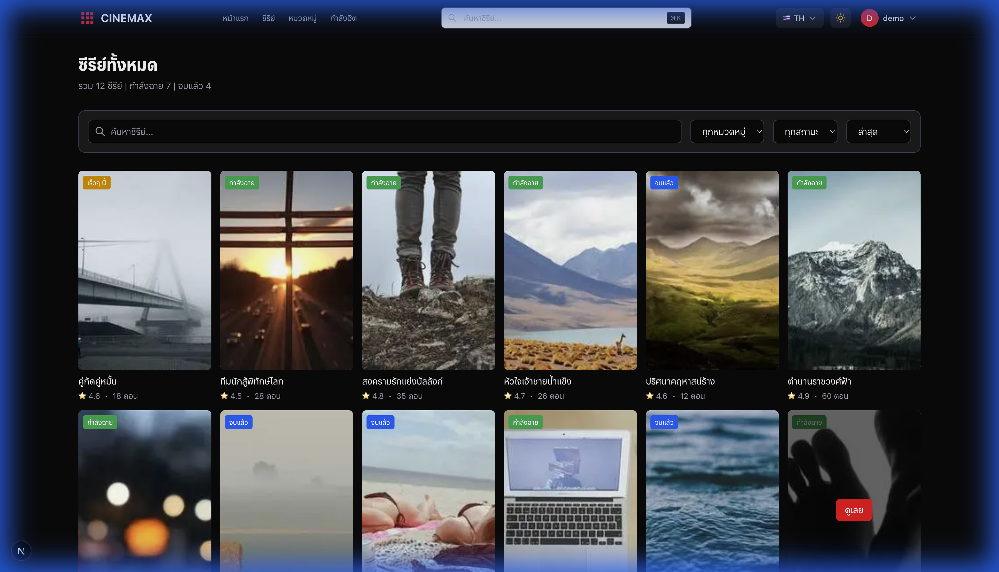
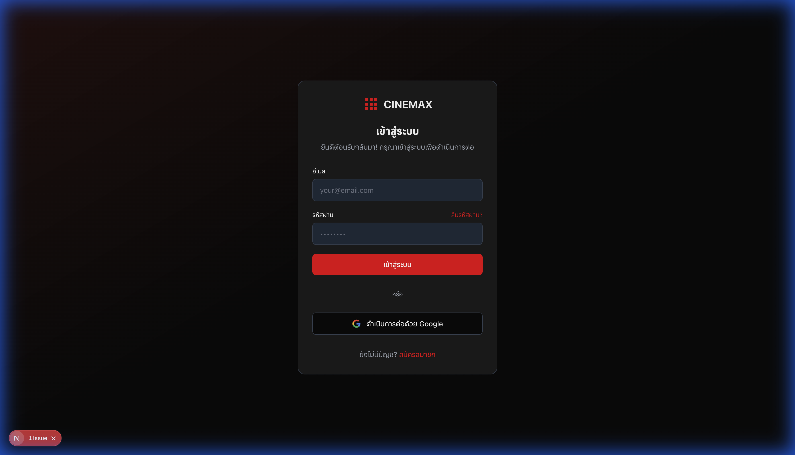

<p align="center">
  
</p>

<h1 align="center">🎬 CINEMAX</h1>

<p align="center">
  <strong>แพลตฟอร์มสตรีมมิ่งซีรีย์ออนไลน์ระดับพรีเมียม</strong>
  <br>
  <em>Premium Streaming Platform for Thai, Korean & Chinese Series</em>
</p>

<p align="center">
  <a href="#features"><strong>Features</strong></a> ·
  <a href="#demo"><strong>Demo</strong></a> ·
  <a href="#tech-stack"><strong>Tech Stack</strong></a> ·
  <a href="#installation"><strong>Installation</strong></a> ·
  <a href="#architecture"><strong>Architecture</strong></a>
</p>

<p align="center">
  
  
  
  
</p>

<p align="center">
  
  
  
</p>

<p align="center">
  
  
  
</p>

---

## ✨ Features

<table>
  <tr>
    <td width="50%">
      <h3>🎥 Streaming</h3>
      <ul>
        <li>HD/4K Video Streaming</li>
        <li>Multi-episode Support</li>
        <li>Continue Watching</li>
        <li>My List (Watchlist)</li>
      </ul>
    </td>
    <td width="50%">
      <h3>🔐 Authentication</h3>
      <ul>
        <li>Email/Password Login</li>
        <li>Social Auth (Google)</li>
        <li>Password Recovery</li>
        <li>Session Management</li>
      </ul>
    </td>
  </tr>
  <tr>
    <td width="50%">
      <h3>💳 Payments</h3>
      <ul>
        <li>Stripe Integration</li>
        <li>Per-series Purchase</li>
        <li>Subscription Plans</li>
        <li>Payment History</li>
      </ul>
    </td>
    <td width="50%">
      <h3>🛠️ Admin Panel</h3>
      <ul>
        <li>Series Management</li>
        <li>Episode Upload</li>
        <li>User Management</li>
        <li>Analytics Dashboard</li>
      </ul>
    </td>
  </tr>
</table>

---

## 📊 Project Stats

```
📁 Project Structure
├── 75+ Components
├── 76+ Presenters (MVP Architecture)
├── 50+ Pages & Routes
├── 7+ Custom Hooks
└── 5+ State Stores (Zustand)
```

| Metric | Count |
|--------|-------|
| 🧩 Components | 75+ |
| 📄 Pages | 50+ |
| 🎨 Presenters | 76+ |
| 🔧 Custom Hooks | 7+ |
| 📦 Dependencies | 20+ |

---

## 🖼️ Demo

### 🏠 Landing Page
The stunning hero section with featured series and smooth animations.

<p align="center">
  
</p>

### 📺 Series Catalog
Browse through our extensive collection of Thai, Korean, and Chinese series.

<p align="center">
  
</p>

### 🔑 Authentication
Beautiful and secure login experience.

<p align="center">
  
</p>

---

## 🛠️ Tech Stack

### Frontend
| Technology | Version | Purpose |
|------------|---------|---------|
| [Next.js](https://nextjs.org/) | 15.5.7 | React Framework with App Router |
| [React](https://react.dev/) | 19.1.2 | UI Library |
| [TypeScript](https://www.typescriptlang.org/) | 5.x | Type Safety |
| [Tailwind CSS](https://tailwindcss.com/) | 4.x | Utility-first CSS |
| [Zustand](https://zustand-demo.pmnd.rs/) | 5.0.8 | State Management |

### Backend & Services
| Service | Purpose |
|---------|---------|
| [Supabase](https://supabase.com/) | PostgreSQL Database & Auth |
| [Stripe](https://stripe.com/) | Payment Processing |
| [Vercel](https://vercel.com/) | Deployment Platform |

### Development Tools
| Tool | Purpose |
|------|---------|
| ESLint | Code Linting |
| Prettier | Code Formatting |
| Turbopack | Fast Bundling |

---

## 📦 Installation

### Prerequisites

- Node.js 18.17+
- npm/pnpm/yarn
- Docker (for local Supabase)

### Quick Start

```bash
# 1. Clone the repository
git clone https://github.com/danya0365/cinemax-nextjs.git
cd cinemax-nextjs

# 2. Install dependencies
npm install

# 3. Set up environment variables
cp .env.example .env.local
# Edit .env.local with your credentials

# 4. Start Supabase (optional - for local development)
npm run supabase-start

# 5. Run development server
npm run dev
```

Open [http://localhost:3000](http://localhost:3000) to see the application.

### Environment Variables

Create a `.env.local` file with the following:

```env
# Supabase
NEXT_PUBLIC_SUPABASE_URL=your_supabase_url
NEXT_PUBLIC_SUPABASE_ANON_KEY=your_anon_key
SUPABASE_SERVICE_ROLE_KEY=your_service_role_key

# Stripe
STRIPE_SECRET_KEY=your_stripe_secret
NEXT_PUBLIC_STRIPE_PUBLISHABLE_KEY=your_stripe_publishable

# App
NEXT_PUBLIC_APP_URL=http://localhost:3000

# Mock Data (for development)
USE_MOCK_DATA=true
```

---

## 🏗️ Architecture

This project follows **Clean Architecture** with **MVP (Model-View-Presenter)** pattern:

```
src/
├── domain/           # Business Logic & Entities
│   ├── entities/     # Core business models
│   └── types/        # TypeScript types
│
├── data/             # Data Layer
│   ├── repositories/ # Data access
│   └── local/        # Local/mock data
│
├── infrastructure/   # External Services
│   ├── config/       # App configuration
│   └── services/     # External APIs (Supabase, Stripe)
│
├── presentation/     # UI Layer
│   ├── components/   # Reusable UI components
│   ├── presenters/   # Business logic for views
│   ├── hooks/        # Custom React hooks
│   └── stores/       # Zustand state stores
│
└── i18n/             # Internationalization
    └── locales/      # Translation files
```

---

## 📜 Available Scripts

| Command | Description |
|---------|-------------|
| `npm run dev` | Start development server with Turbopack |
| `npm run build` | Build for production |
| `npm run start` | Start production server |
| `npm run lint` | Run ESLint |
| `npm run type-check` | Run TypeScript type checking |
| `npm run supabase-start` | Start local Supabase |
| `npm run supabase-stop` | Stop local Supabase |
| `npm run supabase-reset` | Reset Supabase database |
| `npm run supabase-generate` | Generate TypeScript types from Supabase |

---

## 📂 Key Directories

```
app/                    # Next.js App Router pages
├── (auth)/             # Authentication pages
├── admin/              # Admin dashboard
├── api/                # API routes
├── categories/         # Category pages
├── payment/            # Payment flow
├── profile/            # User profile
├── search/             # Search functionality
└── series/             # Series detail & episodes
```

---

## 🔒 Security Features

- 🔐 **JWT Authentication** via Supabase Auth
- 🛡️ **Row Level Security (RLS)** on all database tables
- 🔑 **Environment Variable Protection**
- 🚫 **XSS & CSRF Protection**
- 📝 **Input Validation** with Zod

---

## 🤝 Contributing

Contributions are welcome! Please feel free to submit a Pull Request.

1. Fork the repository
2. Create your feature branch (`git checkout -b feature/AmazingFeature`)
3. Commit your changes (`git commit -m 'Add some AmazingFeature'`)
4. Push to the branch (`git push origin feature/AmazingFeature`)
5. Open a Pull Request

---

## 📄 License

This project is licensed under the MIT License - see the [LICENSE](LICENSE) file for details.

---

## 👨‍💻 Author

**Danya0365**

- GitHub: [@danya0365](https://github.com/danya0365)

---

<p align="center">
  Made with ❤️ and ☕ in Thailand
</p>

<p align="center">
  <a href="#-cinemax">⬆️ Back to Top</a>
</p>
